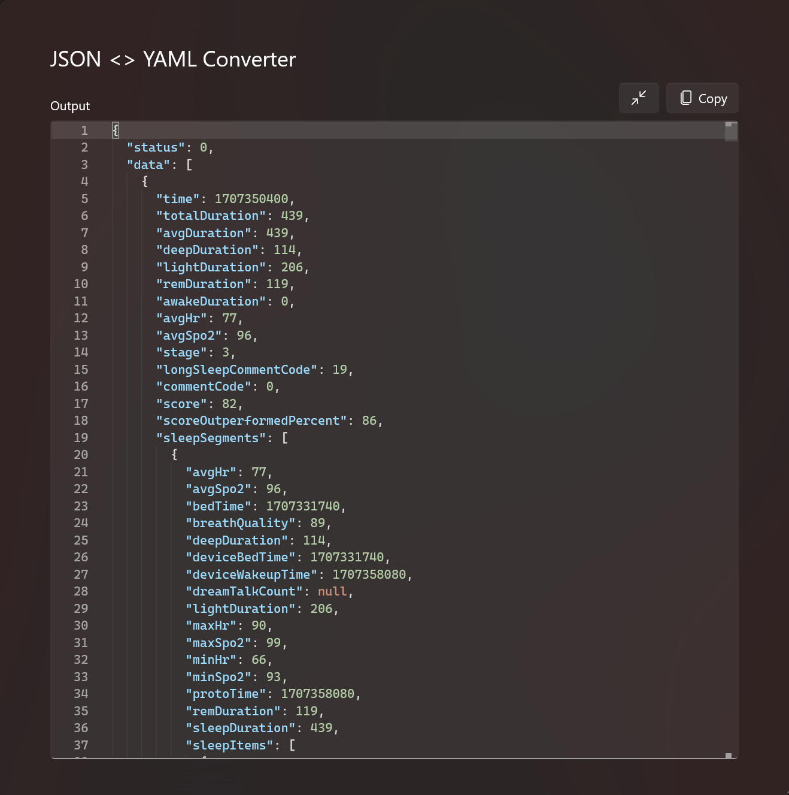

# MiFitness-Uploader-XPosed
An XPosed plugin for "MiFitness(小米健康)", allowing you to fetch the data using socket.

## WARNING
目前仍为不稳定开发版，不提供相关的 release 及文档。代码结构及调用方法等都有可能出现破坏性变更，仅为参考学习。

思路：[我的博客](https://n.ova.moe/blog/MiBand-8-Pro-Data-to-Obsidian) 或 [XLOG](https://x.ouo.sh/MiBand-8-Pro-Data-to-Obsidianmd)

目前会在手机的 23235 端口下监听 GET 请求，路由 `/getDailyReport`，接受两个参数 `type`：可选值 `STEP` 和 `SLEEP`，`date`：时间的格式化字符，如 `2024-02-02`，返回一个 json，包含状态和数据。

